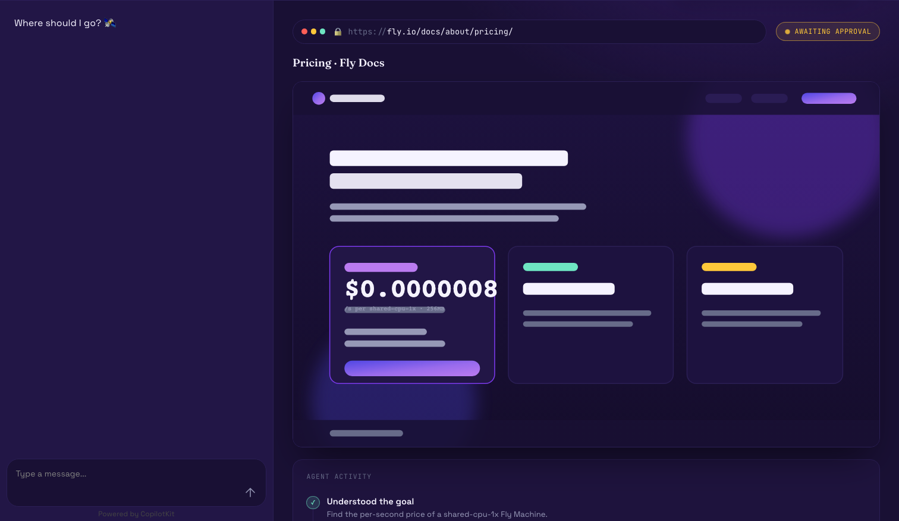
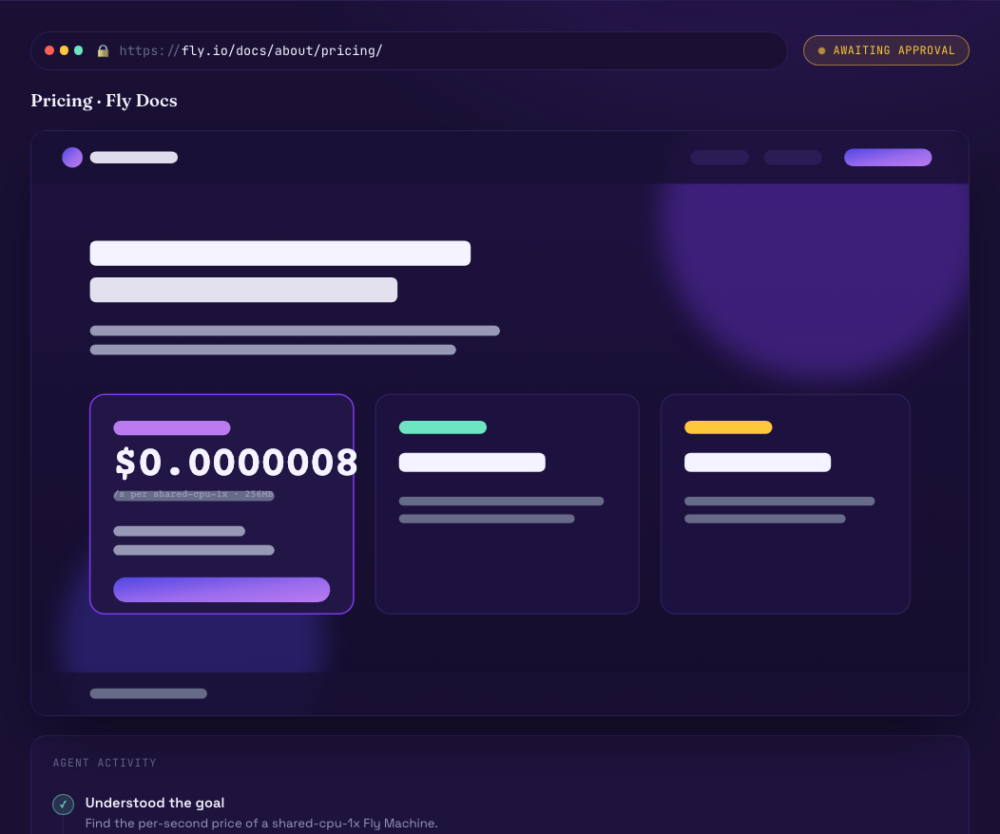
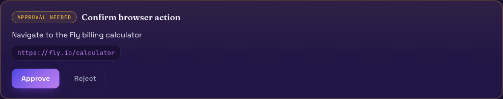
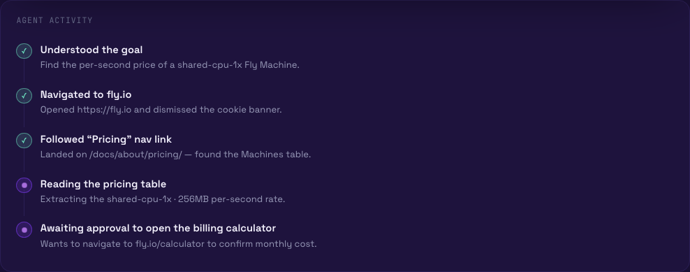

# Browser Pilot — interactive browser agent (MVP)

A web UI where you chat with and steer an AI agent that drives a real browser in
real time. Built on **[CopilotKit](https://copilotkit.ai)** + the
**[AG-UI protocol](https://docs.ag-ui.com)**, with a **fly.io-inspired** dark/violet
design kit.

The agent streams its work as AG-UI events — live page state, each browser action as
a tool call, a step-by-step activity feed, and **human-in-the-loop approval** before it
navigates. The whole UI runs in a **demo mode** by default, so it renders fully without
a backend or any API key.



## What it does

- **Chat + steer** — talk to the agent on the left; watch the browser on the right.
- **Live browser viewport** — URL bar, page screenshot, and a status chip that tracks
  `idle → thinking → acting → waiting_approval → done`.
- **Generative UI activity feed** — every step the agent takes renders inline.
- **Human-in-the-loop** — the agent asks before it navigates; you Approve or Reject.

| Browser viewport | Approval (human-in-the-loop) | Agent activity feed |
|---|---|---|
|  |  |  |

## Architecture

```
Browser (React)                Node (thin bridge)              Python agent
┌────────────────────┐   SSE   ┌──────────────────────┐  AG-UI  ┌─────────────────────┐
│ @copilotkit/react- │ <-----> │ CopilotRuntime route │ <-----> │ FastAPI + ag-ui-    │
│ core + react-ui    │         │ HttpAgent(@ag-ui/    │  (SSE)  │ protocol EventEncoder│
│ CopilotChat,       │         │ client) +            │         │ Claude tool-use loop │
│ useCoAgent,        │         │ ExperimentalEmpty-   │         │ → Playwright Chromium│
│ renderAndWaitFor-  │         │ Adapter              │         │ navigate/click/type/ │
│ Response           │         │                      │         │ screenshot/finish    │
└────────────────────┘         └──────────────────────┘         └─────────────────────┘
        web/                      web/app/api/copilotkit            agent/
```

- The Python agent is the brain + hands: a Claude (`claude-sonnet-4-6`) tool-use loop
  decides actions and executes them against a Playwright Chromium page, emitting AG-UI
  events (`RUN_*`, `TEXT_MESSAGE_*`, `TOOL_CALL_*`, `STATE_SNAPSHOT/DELTA`) over SSE.
- The Node `CopilotRuntime` route is a thin protocol bridge — it registers the Python
  endpoint as an `HttpAgent` and uses `ExperimentalEmptyAdapter` (no LLM key in the
  runtime; the Python agent does all the model work).
- The React app reads shared state via `useCoAgent`, renders the step feed via
  `useCoAgentStateRender`, and gates navigation via `useCopilotAction`'s
  `renderAndWaitForResponse`.

API shapes were copied from the official AG-UI / CopilotKit docs — see
[`PLAN.md`](PLAN.md) Phase 0 for the verified "Allowed APIs" list and sources.

## Run it

### Frontend (`web/`)

```bash
cd web
npm install
npm run dev        # http://localhost:3000  (demo mode on by default)
```

Demo mode is controlled by `NEXT_PUBLIC_DEMO` (default on; set `NEXT_PUBLIC_DEMO=0`
to require the live agent). The runtime points at `AGENT_URL` (default
`http://localhost:8000/`).

### Agent (`agent/`)

```bash
cd agent
python3 -m venv .venv && . .venv/bin/activate
pip install -r requirements.txt
playwright install chromium        # only needed for live (non-demo) runs
cp .env.example .env               # add ANTHROPIC_API_KEY for a live run
uvicorn server:app --port 8000     # leave the key blank to stream the canned demo
```

With **no `ANTHROPIC_API_KEY`** the agent streams a deterministic demo run (no Chromium
required), so you can see the full event flow end-to-end out of the box. Add the key (and
`playwright install chromium`) for a real, Claude-driven browsing session.

## Known limitations

- **Live human-in-the-loop is not a hard pause yet.** The agent surfaces a
  `request_approval` tool call (the approval card you see), but a single SSE run
  can't block waiting for a click that happens after the stream starts — a true
  pause/resume needs cross-run state. For MVP, navigation proceeds unless the
  request already carries a reject. Set `BROWSER_AGENT_REQUIRE_APPROVAL=1` to make
  it **fail closed** (reject when approval isn't present). Full interactive
  resumption is a tracked follow-up.

## Status

MVP v1. **Out of scope** (intentionally): auth, accounts, multi-session, persistence,
deployment configs, test suites, CopilotKit v2 migration. See [`PLAN.md`](PLAN.md).
